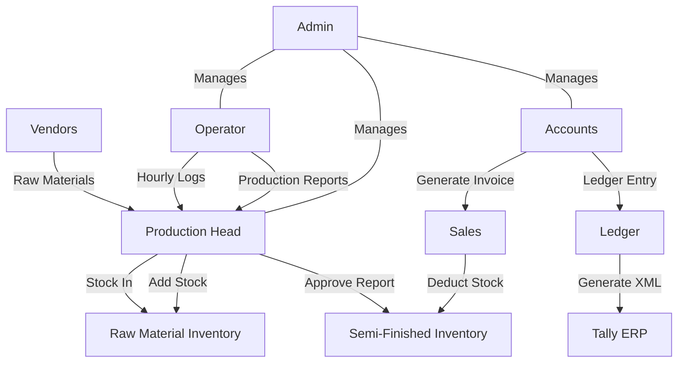

# Factory Management Workflow

This document provides a comprehensive overview of the application's role-based workflow.

## Role Definitions

### 🛠️ Operator
- **App**: `factoryoperator-main`
- **Core Action**: Submit Hourly Logs and Production Reports.
- **Data Flow**: Submits logs (Material, Mold, Cavity, Output) to `production_logs` table.

### 🏭 Production Head
- **App**: `factorymanagement-main`
- **Core Action**: Review and Approve Production Reports.
- **Stock Management**: Adds stock for raw materials (Resin, Colors, Packing) from vendors.
- **Data Flow**: Approving a log updates `inventory_semi_finished.closing_stock`.

### 🏦 Accounts / Accounts Operator
- **App**: `frontend-accounts`
- **Core Action**: Manage Invoices, Ledger, and Tally Export.
- **GST Handling**: Manages 'With GST' and 'Without GST' bills separately.
- **Data Flow**: Generates Tally XML from `sales_invoices` and `purchase_orders`.

### 🛡️ Admin
- **App**: `factorymanagement-main`
- **Core Action**: User Management and Data Oversight.
- **Data Flow**: Full access to all tables (`users`, `inventory`, `sales`).

---

## Workflow Diagram

---

## Process Summary

1. **Procurement**: Production Head enters purchase details, incrementing raw material stock.
2. **Production**: Operator runs machines, reporting hourly output and final run totals.
3. **Quality/Approval**: Production Head reviews run reports. Approved reports automatically move items from 'Work in Progress' to 'Finished Goods'.
4. **Sales & Dispatch**: Accounts creates invoices for customers based on available finished goods.
5. **Accounting**: Accounts processes payments and exports data to Tally for fiscal reporting.
